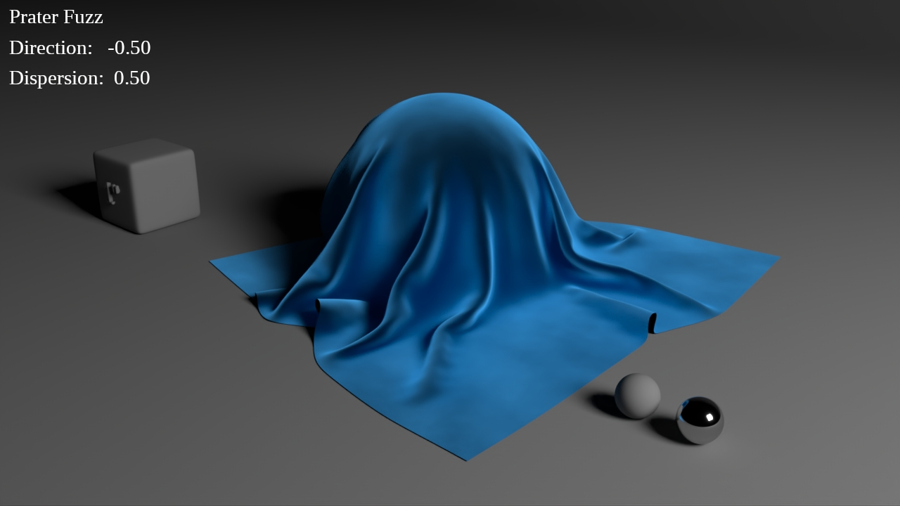
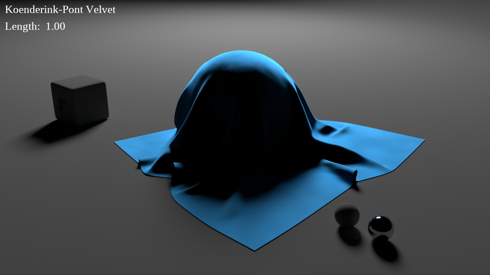
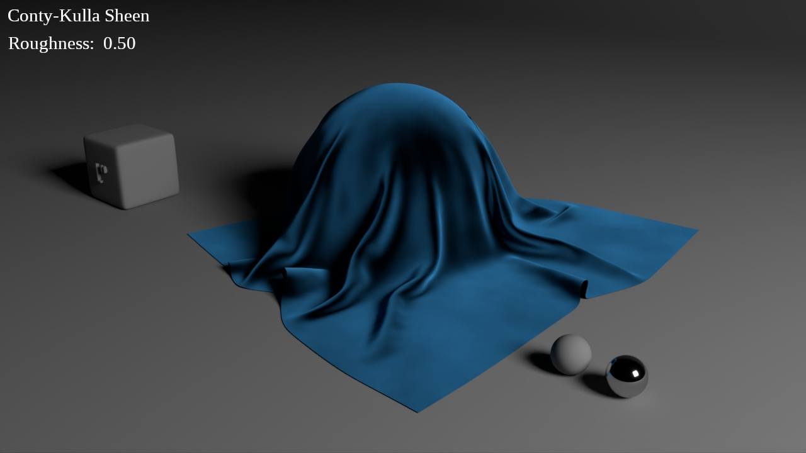
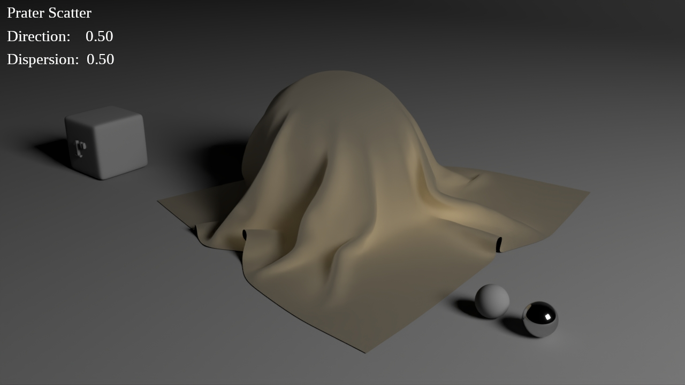
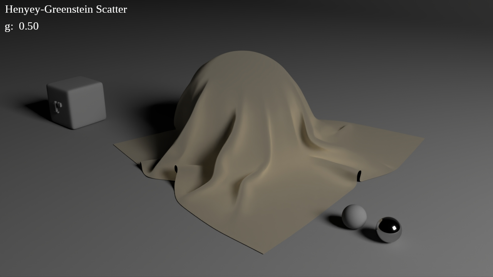
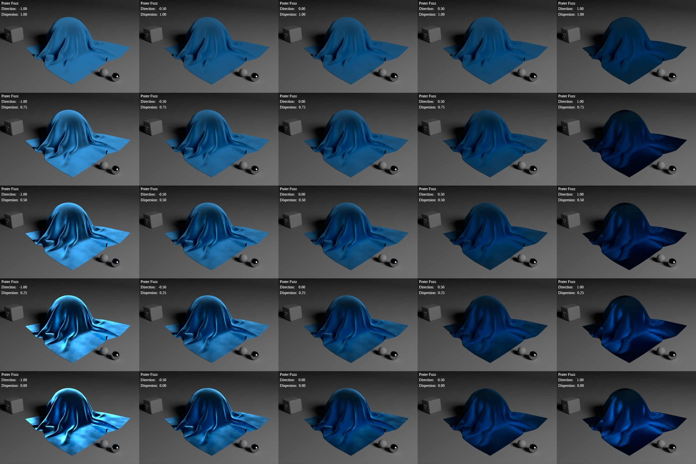
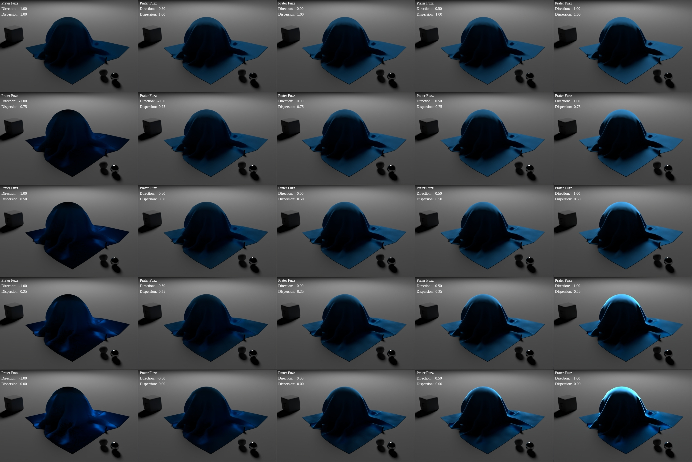
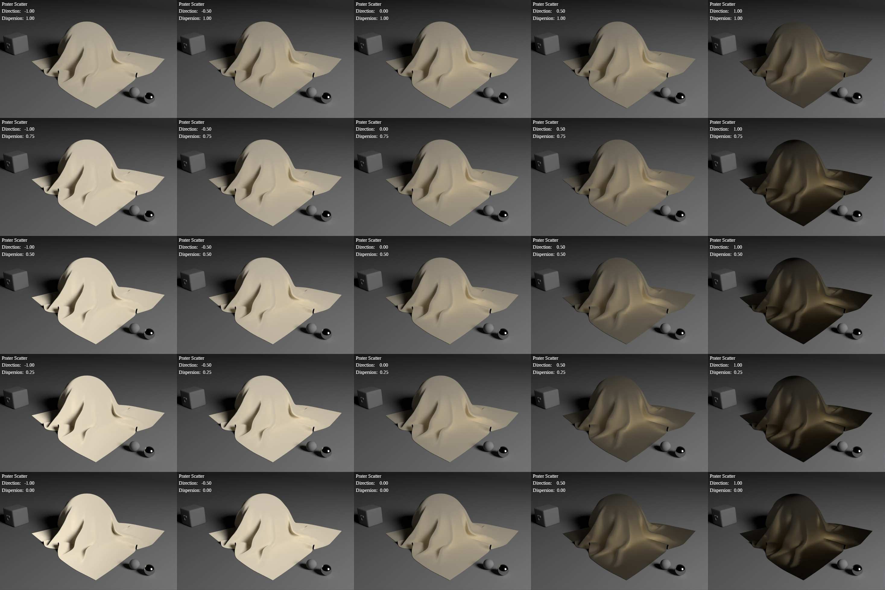
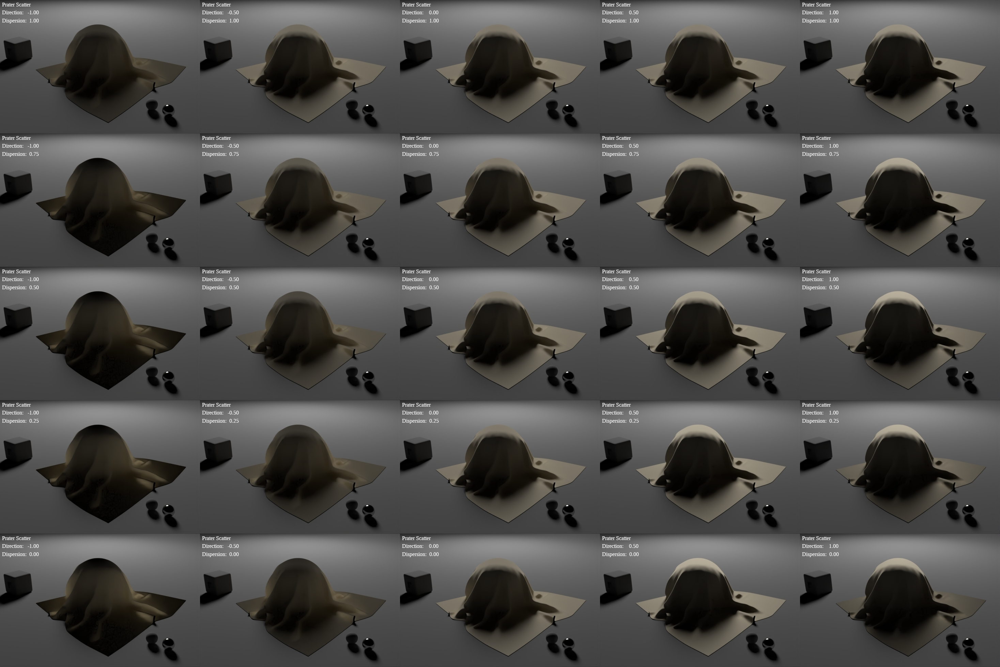

# Surface Boundary Layer Responses

This class of response simulates a thin volume of scattering media at the surface of an object:
super-surface scattering, as opposed to sub-surface scattering.
The inherent properties of different types of scattering media account for the different BxDF response types.

The supplied source code produces the given reflected light response in isolation, whereas these are meant to be used in concert with other responses to produce a complete material response aggregate.
As such, in order to combine these with other responses,
they would have to be incorporated into an uber-shader such as
[PxrSurface](https://rmanwiki.pixar.com/display/REN/PxrSurface) or 
[PxrDisneyBsdf](https://rmanwiki.pixar.com/display/REN/PxrDisneyBsdf).
An even better solution would be to incorporate them into a modular response aggregation system such as [MaterialX Lama](https://rmanwiki.pixar.com/display/REN/MaterialX+Lama).

In addition, given their nature, the transmitted portion of scattered light could be calculated and passed to the underlying surface responses as part of its vertical layering in a combined set of material response strata.
This computation has not yet been implemented in these versions, so as-is their use is limited to horizontal layering (i.e. mixing/blending) when combined with other responses.

First developed at [Pixar](https://www.pixar.com) in the early 1990s for the [REYES](https://dl.acm.org/doi/10.1145/37402.37414) architecture using the [RenderMan Shading Language](https://renderman.pixar.com/resources/RenderMan_20/shadingLanguage.html),
the [Prater Fuzz](#prater-fuzz) and [Prater Scatter](#prater-scatter) models have never been published.
Since their initial creation they have undergone continuous evolution and periodic transformation as [RenderMan](https://renderman.pixar.com/)'s capabilities and implementation details have evolved. 

These most recent incarnations were developed in concert so they each use the same simple and intuitive *Direction* and *Dispersion* control parameters.
*Direction* is analogous to the Henyey-Greenstein[1](#references) *g* parameter,
and *Dispersion* controls the width of the response lobe, similar to a *roughness* parameter.

Other responses are provided as points of comparison.

# Table of Contents

1. [Fuzz](#fuzz)
    1. [Prater Fuzz](#prater-fuzz)
    1. [Koenderink-Pont Velvet](#koenderink-pont-velvet)
    1. [Conty-Kulla Sheen](#conty-kulla-sheen)
1. [Scatter](#scatter)
    1. [Prater Scatter](#prater-scatter)
    1. [Henyey-Greenstein Scatter](#henyey-greenstein-scatter)
1. [Conclusions](#conclusions)
1. [References](#references)
1. [Parameter Wedge Imagess](#parameter-wedge-images)

# Fuzz

This reponse type is designed to simulate the light scattering properties of fibers that are parallel to each other and generally perpendicular to the surface.
It is so named because very short hair or fur that covers a surface is generally described as "fuzz".
Large scale variation in the orientation of the fibers produces one of this response type's most important secondary visual characteristics.

## Prater Fuzz

[Prater Fuzz](../cpp/bxdf/PraterFuzzSampling.inl)
is an empirical response based on my observations. Its primary goal is to provide both realism and a wide range of intuitive artistic control.

Response sampling is done using the upper half of a toroidal sample distribution: a sliced bagel.
This produces far better noise and convergence behavior than simple uniform 
sampling which, as pointed out in *Production Friendly Microfacet Sheen BRDF*[ 3](#references), is not so bad to begin with.
I believe this is a previously undescribed general sampling distribution,
one which is extremely well suited to [Fuzz](#fuzz) response types.

Beginning in 2017, a few response models in this category have been introduced.
An examination of these is contained in the
[Supplementary Materials](https://dl.acm.org/action/downloadSupplement?doi=10.1145%2F3532836.3536240&file=supplemental.pdf)
for
*Practical Multiple-Scattering Sheen Using Linearly Transformed Cosines* [4](#references)
along with their new response model.
At some point I hope to implement this "sheen" model for comparison.
There are also various hair and fur models that have the potential to be applied to this response class.

[Top](#Top)

## Koenderink-Pont Velvet

Created in 2002, *The Secret of Velvety Skin* [5](#references)
contained, as far as I'm aware, the first published model to directly address this type of response with sufficient visual quality and in a manner that was practical for the production-constrained computational resources of the time.
The paper also includes some interesting observations about human visual perception, which is a stimulating theme of these researchers' papers.
However, comparisons with [Prater Fuzz](#prater-fuzz) showed this response function to be inferior in both appearance and range of control.
Also, it only produces forward scattering, so it is useful primarily as a "rim" backlighting effect.

Its implementation uses uniform sample generation, which is entirely adequate for making visual quality and usability assessments.

Other papers from this time period that addressed this response type are *Predicting Reflectance Functions from Complex Surfaces* [6](#references) and *A Microfacet-Based BRDF Generator* [7](#references).
However, the former was not a practical method for production use,
and the visual qualities of both were inferior to the [Prater Fuzz](#prater-fuzz) response.

[Top](#Top)

## Conty-Kulla Sheen

Described in the
[supplemental](https://blog.selfshadow.com/publications/s2017-shading-course/imageworks/s2017_pbs_imageworks_sheen.pdf) material
for the 2017 SIGGRAPH Course *Physically Based Shading in Theory and Practice*[ 3](#references),
this microfacet distribution model is designed to simulate the back-scattering properties of cloth-like materials.

Rather than providing an implementation of this response, I rely on the existing [LamaSheen](https://rmanwiki.pixar.com/display/REN/LamaSheen) node from [RenderMan](https://rmanwiki.pixar.com/display/REN), which I'm told implements this response model.

Given its lack of forward scattering and general absence of any secondary scattering effects in its appearance,
I find this response to be inferior to [Prater Fuzz](#prater-fuzz). However, it's clearly not without merit. In particular, combinations of this and [Koenderink-Pont Velvet](#koenderink-pont-velvet) could be useful.

[Top](#Top)

# Scatter

This response type is designed to produce the light scattering appearance of a collection of small particles such as dust or a random jumble of fibers on the surface of an object. It is so named because it is the scattering properties themselves that are of primary importance rather than any specific type of scattering media.

One should note that this response category has seen very little attention by the CG community in spite of its near universal existence.
Specifically, to my knowledge, no measured data or other research of surface "dust" scattering has ever been published,
and most production approaches now use brute-force methods based on generating huge numbers of fiber or particle primitives.
I have corresponded with [Wenzel Jakob](https://rgl.epfl.ch/people/wjakob/) about this, but at that time, he had no one available to operate his [gonio-photometer](https://rgl.epfl.ch/pages/lab/pgII) scanning equipment to capture this data.

## Prater Scatter

[Prater Scatter](../cpp/bxdf/PraterScatterSampling.inl)
was developed to address deficiencies in the control (and therefore the appearance) of the
Henyey-Greenstein[1](#references)
phase function when used for this purpose.
It is an empirical model based on my observations, with the primary goal of providing both realism and a wide range of intuitive artistic control.

It uses a polynomial normalization function fitted to numerically integrated response intensities from
a set of uniformly spaced and distributed spherical sampling directions [2](#references).
An adaptation of Henyey-Greenstein[1](#references) sample generation was initially used, but was found to be a much poorer choice than simple uniform sampling.

[Top](#Top)

## Henyey-Greenstein Scatter

The Henyey-Greenstein[1](#references) scattering phase function was introduced in 1941.
It is an empirical model intended to describe the scattering of light from interstellar dust.
Early on in computer graphics, it was used as a model for the scattering of light in cloud and smoke volumes due to its simplicity and straightforward sample generation function.

Its role in this capacity has scarcely been questioned since it was first put to this use, likely due to its low computational overhead.
However, given the increased computing power of the past decade or more, it has baffled me that a better alternative was never put forward.
After some years of considering this, I planned to tackle the problem myself.
Thankfully, a far superior model for this purpose than I ever could have produced was finally presented in 
*An Approximate Mie Scattering Function for Fog and Cloud Rendering*[ 8](#references).
It nicely bridges the gap between Mie and Rayleigh scattering
and contains a number of relevant references to more recent particle volume scattering research,
which tends to be focused on astrophysical and biological applications.

While Henyey-Greenstein[1](#references)
does a fair job of mimicking the visual qualities of dust on a surface,
its transitions are too sharp, and it provides too little control over its response characteristics.
These deficiencies were the original impetus for developing the [Prater Scatter](#prater-scatter) response.

[Top](#Top)

# Conclusions

The [Prater Fuzz](#prater-fuzz) and [Prater Scatter](#prater-scatter)
response functions have been around for many years and have withstood the test of time over the course of many productions.
While microfacet and microflake models have become de rigueur for being considered physically based, the once ubiquitous empirical response function has largely been relegated to the ash heap of history.
This, I believe, is a mistake.
Empirical models have the ability to be tailored for their results alone, and thus provide for a far greater range of expression and potential for matching reality as we actually perceive it rather than how we imagine it to be.
And as these response implementations prove, the modern rendering requirements of energy conservation and fast execution do not preclude the use of such models, or the use of inexact sample generation distributions.

# References

1. Henyey, L. G. ; Greenstein, J. L. *Diffuse radiation in the Galaxy*. 1941. Astrophysical Journal, Vol. 93, p. 70-83. https://doi.org/10.1086/144246

2. Sloane, N. J. A. ; et. al. *Tables of Spherical Codes with Icosahedral Symmetry*. 1994. Published electronically at http://NeilSloane.com/icosahedral.codes

2. Conty, Alejandro ; Kulla, Christopher. *Production Friendly Microfacet Sheen BRDF*. 2017. ACM SIGGRAPH Course: *Physically Based Shading in Theory and Practice*, Article 7, p. 1-8. https://doi.org/10.1145/3084873.3084893

3. Zeltner, Tizian ; et. al. *Practical Multiple-Scattering Sheen Using Linearly Transformed Cosines*. 2022. ACM SIGGRAPH Talks, Article 7, p. 1-2. https://doi.org/10.1145/3532836.3536240

4. Koenderink, Jan ; Pont, Sylvia. *The Secret of Velvety Skin*. 2003. Machine Vision and Applications, Vol. 14, p. 260-268. https://doi.org/10.1007/s00138-002-0089-7

5. Westin, Stephen H. ; et. al. *Predicting Reflectance Functions from Complex Surfaces*. 1992. Proceedings of the 19th Annual Conference on Computer Graphics and Interactive Techniques (SIGGRAPH '92), p. 255-264. https://doi.org/10.1145/133994.134075

6. Ashikmin, Michael ; et. al. *A Microfacet-Based BRDF Generator*. 2000. Proceedings of the 27th Annual Conference on Computer Graphics and Interactive Techniques (SIGGRAPH '00), p. 65-74. https://doi.org/10.1145/344779.344814

7. Jendersie, Johannes ; et. al. *An Approximate Mie Scattering Function for Fog and Cloud Rendering*. 2023. ACM SIGGRAPH Talks, Article 47, p. 1-2. https://doi.org/10.1145/3587421.3595409
  
[Top](#Top)

# Parameter Wedge Images

Left to Right: *Direction* ranges from -1 (backward scattering) to +1 (forward scattering).

Top to Bottom: *Dispersion* ranges from 1 (most dispersed) to 0 (most focused).

## Prater Fuzz

### Front Lighting

  
### Back Lighting

  
## Prater Scatter

### Front Lighting

  
### Back Lighting

  
[Top](#Top)
